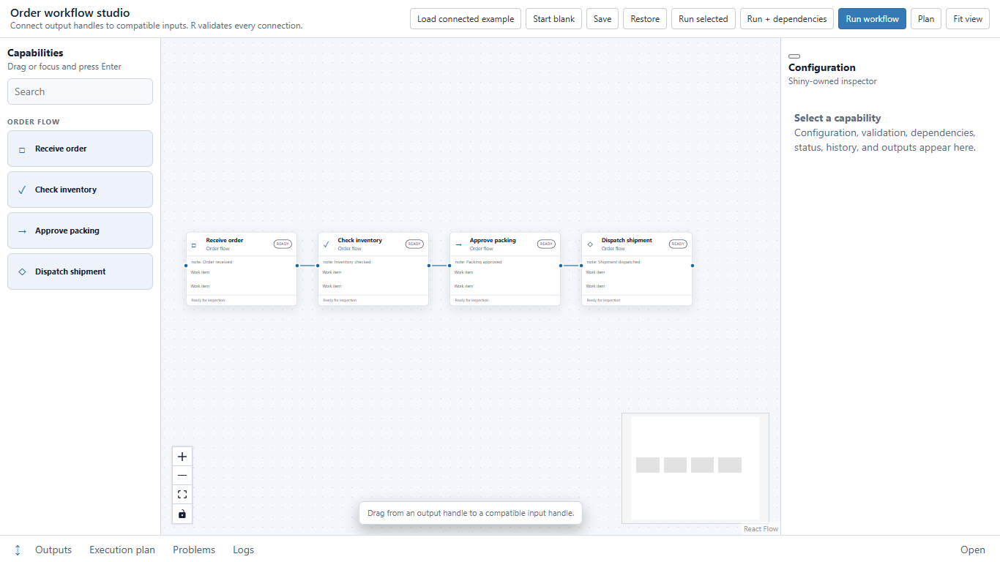

# shinycapabilities

`shinycapabilities` is a private alpha R package for composing governed,
executable capability workflows in Shiny. It combines a React Flow graph editor
with R-owned typed contracts, dependency planning, scheduling, caching,
staleness, cancellation, proposals, composites, and artifact placement.

The package is deliberately generic. Host applications register all
domain-specific capabilities, vocabulary, presentation, and behavior; host
logic and private resources do not belong in this repository.

## Why R owns execution

JavaScript owns smooth browser interaction: graph presentation, selection,
dragging, resizing, connection gestures, pan, zoom, minimap, and fit-to-view.
R/Shiny remains authoritative for registration, validation, typed connections,
dependency closure, execution, lifecycle, caching, cancellation, and artifacts.
The browser never needs private resources, credentials, arbitrary R objects, or
executable node payloads.

## Features

- Closed capability registration and configuration contracts.
- Typed input/output ports and R-validated connections.
- Deterministic graph normalization, fingerprints, and dependency-aware plans.
- Inline, planning-only, network, and supervised background-R profiles.
- Progress, failure, timeout, cancellation, cache, and staleness lifecycle.
- Human acceptance of bounded AI workflow proposals before execution.
- Collapsible composites with deterministic expansion for planning.
- Renderer-independent secondary artifact placement.
- Serializable workflow documents without process handles or runtime state.
- Responsive, searchable, accessible capability palette and Shiny inspector.

## Installation

The repository is private. Authenticate GitHub access before installing:

```r
pak::pak("AdrianAntico/shinycapabilities")
```

Alternatively, clone the repository and install the local source package:

```r
pak::pkg_install("path/to/shinycapabilities")
```

Installed users do not need Node.js. Production JavaScript and CSS are bundled
in the R package.

## Standalone example

The installed package includes an optional, independent light-theme order-flow
example. It is deliberately separate from package core and demonstrates four
host-registered capabilities connected by the neutral `work_item` port type:
Receive order, Check inventory, Approve packing, and Dispatch shipment.

```r
shinycapabilities::run_capability_demo()
```

Drag from the right output handle of one card to the left input handle of the
next. Compatible inputs highlight while dragging. R validates type compatibility,
duplicates, input cardinality, self-connections, and cycles before the browser
adds an edge. Focus a palette item and press Enter for keyboard insertion.



## Minimal host application

```r
library(shiny)
library(shinycapabilities)

registry <- capability_registry()
capability_registry_add(registry, register_capability(
  "example.step", "1.0.0", "Example step",
  outputs = list(item = port_type("work_item")),
  execute = function(context, config, inputs) list(item = context$item)
))

ui <- fluidPage(
  capability_canvas_ui("workflow", registry, height = "680px")
)

server <- function(input, output, session) {
  capability_canvas_server("workflow", registry)
}

shinyApp(ui, server)
```

`default_capability_catalog()` is intentionally empty: package core does not
claim ownership of any domain catalog.

## Register a host capability

```r
formatter <- register_capability(
  id = "example.format",
  version = "1.0.0",
  display_name = "Process item",
  description = "Create a bounded host-owned result.",
  category = "Host steps",
  inputs = list(item = port_type("work_item")),
  outputs = list(item = port_type("work_item")),
  config = list(
    style = config_field("select", "Style", "plain", c("plain", "formal"))
  ),
  validate = function(context, config, inputs) {
    list(valid = !is.null(inputs$item))
  },
  execute = function(context, config, inputs) {
    list(item = utils::modifyList(inputs$item, list(style = config$style)))
  },
  implementation_fingerprint = "example-format-v1"
)

registry <- capability_registry()
capability_registry_add(registry, formatter)
```

Hosts may provide custom Shiny configuration UI/server hooks. Typed connection
acceptance remains R-owned.

## Host styling

The widget exposes documented neutral CSS custom properties rather than a host
theme. Scope overrides to the host shell so multiple studios can coexist:

```css
.my-workflow-shell {
  --shinycap-color-background: #f7f9fc;
  --shinycap-color-panel: #ffffff;
  --shinycap-color-text: #172033;
  --shinycap-color-selection: #1769aa;
  --shinycap-palette-width: 220px;
  --shinycap-inspector-width: 300px;
}
```

The optional example uses only these hooks. It does not load styling or
vocabulary from a host application.

## Execution and cancellation

`plan_workflow()` computes the transitive upstream closure and deterministic
topological order. Signatures include configuration, capability version,
implementation fingerprint, and dependency signatures. Current successful cache
entries may be reused.

`workflow_runtime()` and `tick_workflow_runtime()` provide non-blocking lifecycle
management. Supervised background R work uses owned `callr` processes. Failed,
cancelled, crashed, or timed-out work does not register partial artifacts.

## Proposals, composites, and artifacts

`workflow_proposal()` ingests a bounded proposed graph. Nothing becomes
executable until the host calls `accept_workflow_proposal()`.

`collapse_workflow()` and `expand_workflow_composite()` preserve internal graph
structure while presenting a composite node. Planning expands composites before
validation and execution.

`workflow_document()` stores the normalized graph separately from secondary
`output_placements`, so arranging artifacts does not mutate workflow semantics.

## Development

Rebuild browser assets reproducibly:

```powershell
npm --prefix tools/javascript ci
npm --prefix tools/javascript run build
```

Regenerate R documentation and validate:

```powershell
Rscript -e "roxygen2::roxygenise('.', roclets = c('rd', 'namespace'))"
Rscript -e "devtools::test()"
R CMD build .
R CMD check shinycapabilities_0.1.0.tar.gz
```

See [ARCHITECTURE.md](ARCHITECTURE.md), [CONTRIBUTING.md](CONTRIBUTING.md), and
`inst/docs/DEPENDENCY-LICENSES.md`.

## Alpha limitations

- Public contracts are alpha and may evolve only through compatibility review.
- Hosts own authentication, authorization, persistence, deployment hardening,
  domain validation, and durable artifact storage.
- Formula fields are text inputs; hosts must use bounded expression parsers.
- Persistent run history and distributed scheduling are host concerns.
- Provider execution for AI proposals remains host-owned.
- The package has not received production security certification.

## License and attribution

`shinycapabilities` is licensed under the MIT license. Bundled React Flow, React,
and related dependency attribution is documented in
`inst/docs/DEPENDENCY-LICENSES.md`.
